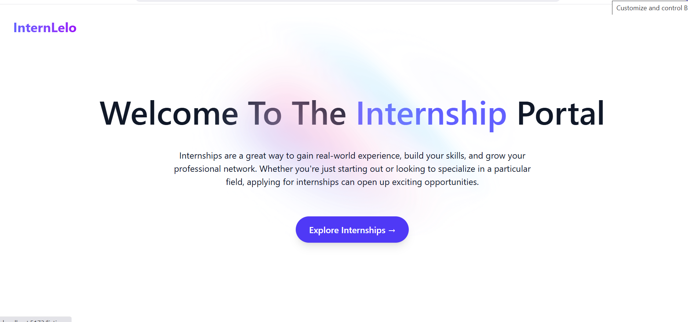
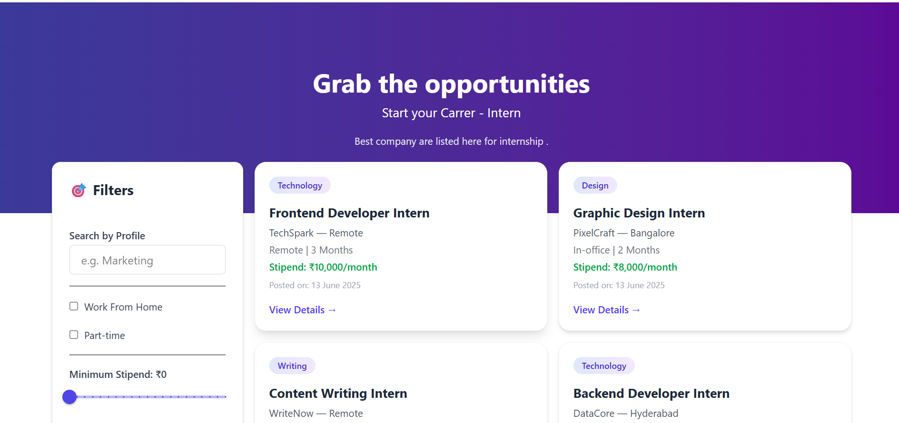
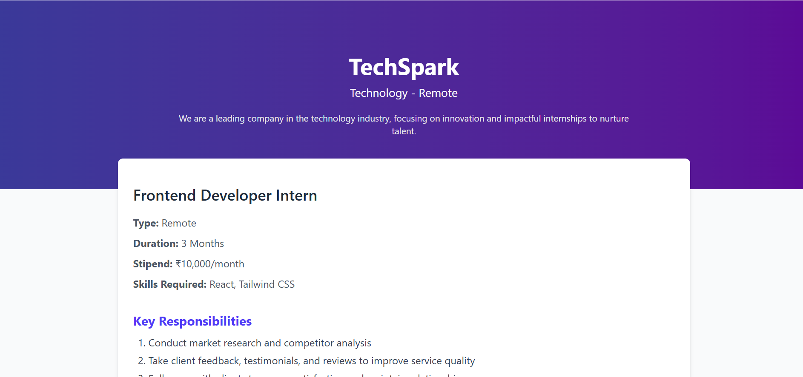
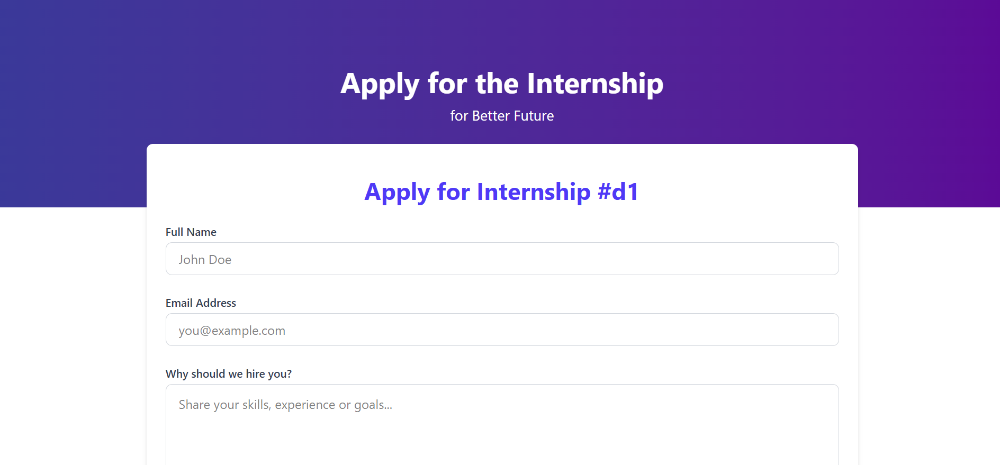
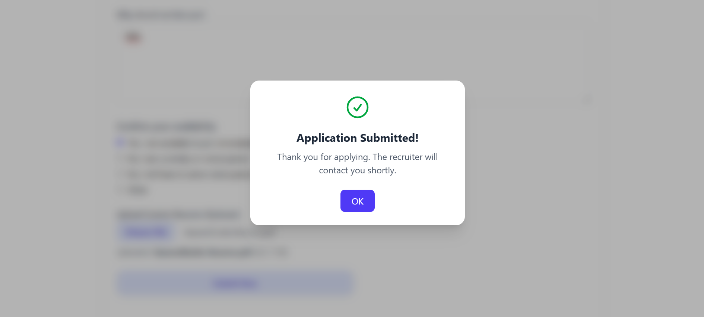

# Build a Modern Intern Portal with React & TailwindCSS

    
   
  
  

    
    
    
    
    
  

  <h3 align="center">Create a Intern Portal, Dark Mode, and Projects Showcase</h3> 
   

## 📋 Table of Contents

1. [Introduction](#-introduction)
2. [Tech Stack](#-tech-stack)
3. [Features](#-features)
4. [Quick Start](#-quick-start)
5. [Screenshots](#-screenshots)
6. [Deployment](#-deployment)

---

## 🚀 Introduction

 **InternLelo – Internship Portal**
InternLelo is a responsive, user-friendly internship portal built using React.js, Tailwind CSS, and Redux Toolkit. Designed to streamline the internship discovery and application process, this portal allows students to explore various opportunities across different domains like frontend development, marketing, and design.

The landing page features an animated hero section using Framer Motion to create an engaging first impression. The UI supports light and dark themes, ensuring accessibility and visual comfort across all devices, including mobile. Users can browse internship listings with detailed descriptions, responsibilities, and start dates. Each internship has a dedicated detail page, and candidates can apply through a dynamic application form, ensuring a seamless flow.

State management is handled with Redux, enabling smooth navigation and user interactions without unnecessary re-renders. The design is clean and modern, using Tailwind’s utility-first classes to maintain consistency and performance.

This project emphasizes real-world job search experience and showcases full-stack integration readiness, offering scalability for backend connection via Express.js or Firebase in the future. InternLelo stands as a practical tool for both learning and deployment in real educational or training environments.

---

## ⚙️ Tech Stack

* **React** – Component-based UI development
* **Vite** – Lightning-fast build tool
* **TailwindCSS** – Utility-first CSS for styling
* **Toastify** – For giving the pop message 
* **GitHub & Vercel** – Deployment

---

## ⚡️ Features

* 🌑 **Transition**
  Save theme preference in local storage with beautiful transitions

* 💫 **Animated Backgrounds**
 scroll effects, and glowing UI elements

* 📱 **Responsive Navigation**
  Desktop and mobile menus with glassmorphism

* 👨‍💻 **Landing & Listing  Sections**
  Showcase who you are with smooth intro animations and buttons

* 📊 **Skills Grid**
  Filterable progress bars and categories with animated width

* 🖼️ **Projects Showcase**
  Display screenshots, tech stacks, and GitHub/demo links

* 📩 **Contact Section**
  Social icons + responsive contact form with toast notifications

* 🚀 **One-Click Deployment**
  Easily host your site with Vercel and GitHub

---

## 👌 Quick Start

Your app will be available at: https://intern-portal-6vi7.vercel.app/

---

## 🖼️ Screenshots

> 📸 Add screenshots of your Hero section, Projects grid, and Contact form here to show off your site.

   
   
   
   

---

## ☁️ Deployment

### Deploy on Vercel

1. Push your code to GitHub
2. Go to [vercel.com](https://vercel.com)
3. Import your repository
4. Click **Deploy**

Your live website will be hosted on https://intern-portal-6vi7.vercel.app/

---

## 🔗 Useful Links

* [React Documentation](https://reactjs.org/)
* [Tailwind CSS Docs](https://tailwindcss.com/)
* [Lucide Icons](https://lucide.dev/)
* [Radix UI](https://www.radix-ui.com/)
* [Vite](https://vitejs.dev/)
* [Vercel](https://vercel.com/)

---

